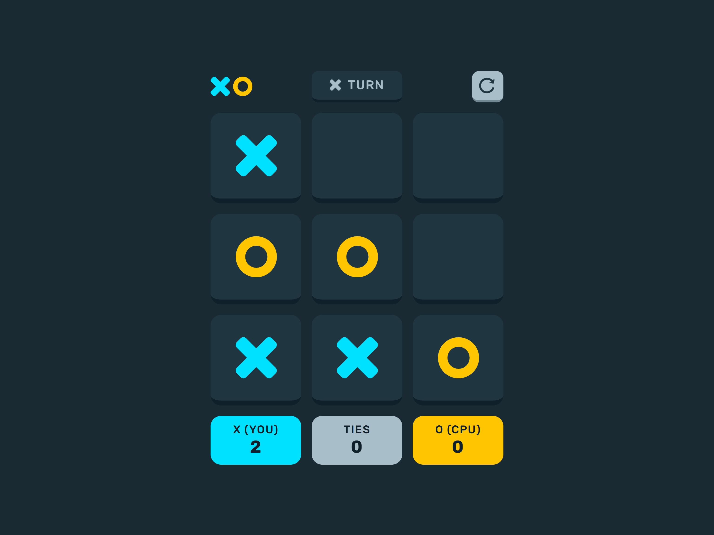

# Project Overview

## Table of contents

-  [Overview](#overview)
   -  [Features](#features)
   -  [Rules](#rules)
   -  [Screenshots](#screenshots)
   -  [Links](#links)
-  [My process](#my-process)
   -  [Built with](#built-with)
   -  [What I learned](#what-i-learned)
   -  [Continued development](#continued-development)
   -  [Useful resources](#useful-resources)
-  [Author](#author)

## Overview

### Features

Users should be able to:

- View the optimal layout for the game depending on their device's screen size
- Play tic tac toe against the computer
- Maintain the game's score state after refreshing the browser
- Reset the score/board

### Screenshots

***Desktop Layout*** (1440 X 900)\

***Tablet Layout*** (768 x 1024)\

***Mobile Layout*** (375 x 667) \

### Links

- Solution URL: [Github Respository](https://github.com/jordan-na/tic-tac-toe)
- Live Site URL: [Hosted on Github Pages](https://jordan-na.github.io/tic-tac-toe/)

## My process

### Built with

- Semantic HTML5 markup
- CSS custom properties
- Flexbox
- CSS Grid
- Desktop-first workflow
- Vanilla JS
- ES6 module patterns with IIEF's

### What I learned

-  Non-technical skills:

   -  Creating smaller sub goals to finish overall project
   -  Creative design, coming up with a responsive UI that is aesthetically pleasing
   -  Ability to plan and stick to a work schedule with an estimated date of completion
   -  Perserverance to finish the task, even through challenging times
   -  Creating a project not only through the eyes of a developer, but through the eyes of a consumer
      -  Helped me tweak certain features to be mroe user friendly

-  Technical skills:
   -  Responsive UI/UX development
      -  Using the chrome inspector to emulate different screen sizes
   -  Using CSS grid to create responsive and dynamic layouts
   -  CSS media queries
   -  Using LocalStorage API to save scores
   -  Module design patterns to allow code reusability, organization, and readability
      -  *event-handler.mjs*: Responsible for setting up events
      -  *TicTacToe.mjs*: Contains all game logic and state
      -  *TicTacToePlayer.mjs*: Contains all player logic including ability to check for win
      -  *score-tracker.mjs*: Respomsible for updating scores and storing it in LocalStorage

### Continued development

-  I will continue to refine my vanilla JS and no-framwork CSS approach before moving onto libraries/frameworks
-  After I have complete a multitude of no library/framework projects, I will learn _React_ and implement it with my knowledge of _Node.js_ and _Express.js_
- Eventually, the goal is to complete a full stack web app that has a use for society

### Useful resources

-  [MDN](https://developer.mozilla.org/en-US/docs/Web/JavaScript) - This helped me by acting as a reference for the built in js API
-  [Local Storage API](https://developer.mozilla.org/en-US/docs/Web/API/Window/localStorage) - I referred to the documentation to use the Local Storage API

## Author

-  Name: Jordan Na
-  Website - [Github Profile](https://github.com/jordan-na)
-  Frontend Mentor - [@jordan-na](https://www.frontendmentor.io/profile/jordan-na)
-  Email - jordster02@gmail.com